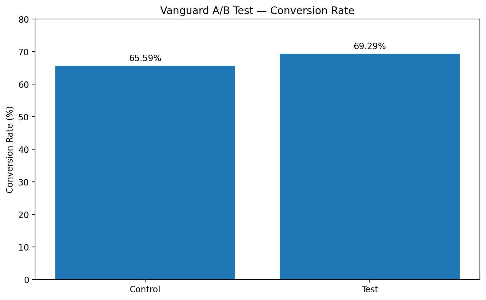

# Project 5 — Vanguard A/B Test

## 📊 Project Overview

This project analyzes the results of an A/B test conducted for Vanguard to evaluate whether a redesigned digital customer experience improves the user journey and conversion rate.

The analysis compares two experimental groups:

- **Control:** users who experienced the existing digital process.
- **Test:** users who experienced the redesigned digital process.

The main objective is to determine whether the redesigned experience produces a statistically significant improvement in conversion, while also identifying potential friction points in the customer journey.

---

## 🎯 Business Objective

### Main Business Question

> **Does the redesigned digital experience improve customer conversion compared with the existing experience?**

The project combines customer journey analysis, funnel analysis, user behaviour analysis, A/B testing, statistical hypothesis testing and data visualization to answer this question.

---

## 🔬 A/B Test

| Group | Description |
|---|---|
| **Control** | Existing digital experience |
| **Test** | Redesigned digital experience |

Expected customer journey:

`Start → Step 1 → Step 2 → Step 3 → Confirm`

A successful conversion is defined as a client reaching the **`confirm`** step.

---

## 🗂️ Data

### Experiment Clients

The experiment dataset contains client-level information including `client_id` and `Variation`.

The dataset contains **70,609 clients**:

- **23,532 Control**
- **26,968 Test**
- **20,109 without a recorded Variation**

Clients without an experimental assignment were investigated separately and were **not artificially assigned** to either group.

### Web Interaction Data

The web interaction datasets contain:

- `client_id`
- `visitor_id`
- `visit_id`
- `process_step`
- `date_time`

The web datasets were combined and cleaned before the final analysis.

### Final A/B Test Population

| Variation | Clients |
|---|---:|
| Control | 23,532 |
| Test | 26,968 |
| **Total** | **50,500** |

---

## 🧹 Data Cleaning & Preparation

The project included:

- Inspecting dataset structure, shapes and columns
- Checking data types and missing values
- Checking duplicated records and unique clients
- Comparing client IDs across datasets
- Identifying clients with and without experiment assignments
- Sorting website interactions chronologically
- Grouping interactions by `visit_id`
- Reconstructing customer journeys
- Identifying incomplete journeys
- Identifying repeated process steps
- Identifying backward navigation
- Creating client-level conversion indicators
- Merging datasets using `client_id`

No artificial Test or Control assignments were made for clients with missing experimental variation.

---

## 🔎 Customer Journey Analysis

### Funnel Analysis

| Process Step | Unique Visits | Conversion from Start |
|---|---:|---:|
| Start | 25,601 | 100.00% |
| Step 1 | 20,668 | 80.73% |
| Step 2 | 17,832 | 69.65% |
| Step 3 | 16,222 | 63.36% |
| Confirm | 15,189 | 59.33% |

The largest drop-off occurs between `Start → Step 1`.

Overall visit-level conversion from `start` to `confirm` was **59.33%**.

### Visits per Client

- **Average visits per client:** 1.38
- **Median visits per client:** 1
- **Maximum visits by one client:** 21
- **Clients with one visit:** 14,865
- **Clients with multiple visits:** 5,244

### Repeated Process Steps

- **Total visits:** 27,757
- **Visits with repeated steps:** 11,346
- **Percentage with repeated steps:** 40.88%

The most frequently repeated step was **Start**.

| Process Step | Visits with Repetition |
|---|---:|
| Start | 8,268 |
| Step 1 | 4,605 |
| Step 2 | 3,165 |
| Step 3 | 2,189 |
| Confirm | 1,376 |

### Backward Navigation

- **Total visits:** 27,757
- **Visits with backward steps:** 6,573
- **Visits without backward steps:** 21,184
- **Visits with backward steps:** 23.68%
- **Visits without backward steps:** 76.32%

The most common backward transition was `Step 1 → Start`, representing **34.37%** of backward transitions.

### Backward Navigation and Completion

| Visit Type | Visits | Completed | Completion Rate |
|---|---:|---:|---:|
| No backward steps | 21,184 | 12,093 | **57.09%** |
| Backward steps | 6,573 | 3,096 | **47.10%** |

Visits containing backward navigation had a completion rate approximately **9.99 percentage points lower** than visits without backward navigation. This is an **association**, not proof that backward navigation directly causes abandonment.

---

# 📈 A/B Test Results

Conversion was calculated at the **client level**. A client was considered converted when their web activity contained the final `confirm` step.

| Variation | Clients | Conversions | Conversion Rate |
|---|---:|---:|---:|
| Control | 23,532 | 15,434 | **65.59%** |
| Test | 26,968 | 18,687 | **69.29%** |

### Conversion Improvement

**Absolute improvement:**

`69.29% − 65.59% = +3.70 percentage points`

**Relative improvement:** approximately **+5.64%**.

---

## ⏱️ Additional A/B Test Performance

The Tableau dashboard also compares average completion time and error rate.

| Metric | Control | Test | Interpretation |
|---|---:|---:|---|
| Conversion Rate | 65.59% | **69.29%** | ✅ Test performs better |
| Average Time | **8.55 min** | 9.78 min | ⚠️ Test takes longer |
| Error Rate | **6.82%** | 9.25% | ⚠️ Test has more errors |

### Key Trade-off

The Test experience improves conversion, but this improvement comes with higher average completion time and a higher error rate. The Test should therefore be evaluated on conversion, usability and operational efficiency together.

---

## 🧪 Statistical Hypothesis Testing

A **Two-Proportion Z-Test** was used to determine whether the difference between Control and Test conversion rates was statistically significant.

### Null Hypothesis — H₀

`H₀: p_test = p_control`

There is no significant difference in conversion rates between Control and Test.

### Alternative Hypothesis — H₁

`H₁: p_test ≠ p_control`

There is a significant difference in conversion rates between Control and Test.

### Test Results

- **Z-statistic:** -8.8745
- **P-value:** < 0.001
- **Significance level:** 0.05

Since `p < 0.05`, the null hypothesis is rejected.

### Statistical Conclusion

The difference in conversion rates between Test and Control is **statistically significant**. The Test experience produced a significantly higher conversion rate.

---

## 💡 Key Findings

1. **The Test experience increases conversion:** 69.29% vs 65.59%, a **+3.70 percentage-point** and approximately **+5.64% relative** improvement.
2. **The improvement is statistically significant:** the Two-Proportion Z-Test produced **p < 0.001**.
3. **The customer journey contains friction:** 23.68% of visits included backward navigation, 40.88% included repeated steps, and visit-level conversion was 59.33%.
4. **Backward navigation is associated with lower completion:** 57.09% without backward navigation versus 47.10% with it.
5. **There is a usability trade-off:** Test conversion is higher, but Test also has higher average time (9.78 vs 8.55 minutes) and error rate (9.25% vs 6.82%).

---

## 📊 Visualizations & Tableau Dashboard

The project includes visual analysis of:

- Customer funnel
- Conversion rates
- Control vs Test performance
- Average time by process step
- Average completion time
- Error rate
- Customer age
- Customer tenure
- Customer tenure distribution
- Number of accounts
- User journey behaviour
- Backward transitions
- Repeated process steps

The final Tableau dashboard, **A/B Test — Control vs Test**, brings together the four main A/B test views:

1. Conversion Rate — Control vs Test
2. Average Time by Step — Control vs Test
3. Average Time — Control vs Test
4. Error Rate — Control vs Test

---

## 🛠️ Tools & Technologies

### Programming & Data Analysis

- Python
- Pandas
- NumPy

### Statistical Analysis

- Statsmodels
- Two-Proportion Z-Test
- Hypothesis testing
- Conversion rate analysis

### Data Visualization

- Matplotlib
- Seaborn
- Tableau

### Development Environment

- Jupyter Notebook
- Visual Studio Code

### Version Control

- Git
- GitHub

---

## 📚 Main Python Techniques

The project includes practical use of:

- `pandas.read_csv()`
- DataFrame filtering
- Boolean indexing
- `groupby()`
- `agg()`
- `apply()`
- `merge()`
- `isin()`
- `unique()`
- `nunique()`
- `value_counts()`
- `reset_index()`
- `sort_values()`
- Sets and set operations
- Proportion calculations
- Statistical hypothesis testing

---

## 🚀 Analytical Methodology

`Raw Data → Data Inspection → Data Cleaning → Data Validation → Dataset Integration → Customer Journey Reconstruction → Funnel Analysis → User Behaviour Analysis → A/B Test Analysis → Conversion Rate Comparison → Statistical Hypothesis Testing → Business Conclusion`

---

## 📋 Project Management — Trello

Project planning, task organization and progress tracking were supported through a **Trello board**.

🔗 **Trello Project Board:**

https://trello.com/b/kPnXr8jv/the-importance-and-correlation-between-education-marketing-degree-masters-degree-data-analytics-bootcamp-and-career-success

---

## 📌 Business Interpretation

The results provide strong evidence that the redesigned digital experience increases the likelihood that clients complete the online process.

Conversion increased from **65.59% → 69.29%**, representing **+3.70 percentage points** and approximately **+5.64% relative improvement**.

However, the Test experience also shows a higher average completion time and a higher error rate. The business decision should therefore consider conversion, usability and operational efficiency together.

Potential benefits include:

- Increased digital conversion
- Improved completion of the online customer journey
- Reduced customer drop-off
- Improved digital onboarding performance
- More clients reaching the final confirmation stage

Before full implementation, the practical and financial impact should be evaluated.

---

## 🏁 Final Conclusion

The A/B test provides strong statistical evidence that the **Test experience performs better than the Control experience in terms of conversion**.

The Test group achieved **69.29% conversion**, compared with **65.59% for Control**:

- **+3.70 percentage points**
- **≈ +5.64% relative improvement**
- **p < 0.001**

The redesigned experience therefore has a statistically significant positive effect on conversion. However, the higher conversion rate is accompanied by higher completion time and a higher error rate.

### Final Recommendation

The **Test experience should be considered for implementation**, while continuing to optimize usability and reduce friction. Further work should focus on reducing repeated actions, backward navigation, early-stage drop-off and errors.

---

## 👩‍💻 Author

**Teresa Mendes Coelho**  
Data Analytics Bootcamp — Ironhack
